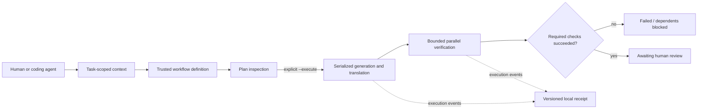

# NumbahWan TCG

**A trading card game and a working testbed for reliable AI-assisted development.**

TypeScript game systems, a Hono/Cloudflare web application, and the tooling used
to build and check them. The engineering question behind the harness is simple:
**how do you distinguish a successful agent action from a convincing report of one?**

[Architecture](./ARCHITECTURE.md) · [Evidence & limitations](./docs/CREDIBILITY.md) ·
[Agent entry point](./AGENTS.md) · [PR checks](https://github.com/9tvf4k6srt-sys/NumbahWan-tcg/actions/workflows/pr-gate.yml)

## Start here: a two-minute technical review

Requires **Node.js 20+**. These two commands need no dependencies, API keys,
network access, running web server, or model spend:

```bash
node bin/orchestrator.cjs --demo --json
node --test tests/orchestration.test.cjs
```

The demo runs three real Node subprocesses over **synthetic tasks** and prints a
structured execution receipt. It does not call an LLM or write project files.
The tests exercise the same runtime used by the factory, including failure
injection and real subprocess cancellation. This is a reliability regression
suite, **not a model-capability benchmark**.

Then inspect these four files:

| Question | Implementation / evidence |
|---|---|
| Who controls what a workflow may do? | [`bin/orchestrator.cjs`](./bin/orchestrator.cjs): trusted tool registry, validated spec paths, plan-only default |
| What happens when a tool fails or hangs? | [`tools/lib/workflow-runtime.cjs`](./tools/lib/workflow-runtime.cjs): DAG validation, execution budgets, failure propagation |
| Do the guarantees survive adversarial cases? | [`tests/orchestration.test.cjs`](./tests/orchestration.test.cjs): failure subsets, literal shell metacharacters, deadlines, retries, cancellation |
| Does anyone enforce the tests? | [`bin/ship-gate.cjs`](./bin/ship-gate.cjs): blocking offline suite, invoked by the existing PR workflow |

## Architecture in one view



**Control is deterministic; generation tools are replaceable.** The current
intent parser uses patterns and templates, not an LLM planner. Tool results
cannot introduce new tools, increase budgets, or grant deployment authority.
Read-only checks can run concurrently; writes never overlap within one run.
There is no deploy or merge capability in this workflow.

This boundary is deliberate. Adding a model-generated plan or a swarm would
increase the failure surface before establishing whether it improves the task.
The [architecture trade-offs](./ARCHITECTURE.md#factory-workflow-control-plane)
explain what is guaranteed, what is merely convention, and what is not built.

## Three kinds of evidence—not one headline score

| Layer | Run | What it measures |
|---|---|---|
| Execution reliability | `npm run test:orchestration` | Deterministic runtime and subprocess invariants |
| Context cost and documentation consistency | `npm run eval` | File-derived token estimates and mechanical doctrine checks |
| Model answer quality | `npm run eval:outcome:dry`, then configure the provider before a paid run | Paired answers with / without a memory briefing; mechanical grading |

Passing the first two does **not** establish the third. Token estimates are
not billed usage. A dashboard heartbeat is not proof that a task ran.
See [dated results and exclusions](./docs/CREDIBILITY.md) before interpreting a number.

## Working with the factory

```bash
npm ci

# Inspect a plan: does not run generation or verification tools.
node bin/orchestrator.cjs "Add a DLC about fire dragons" --json

# Explicit opt-in: modifies local files, verifies, then stops for human review.
# Use a disposable branch/worktree and inspect the plan and spec first.
node bin/orchestrator.cjs --from-spec specs/YOUR_SPEC.yaml --execute --json

npm run test:unit       # application and tooling unit tests
npm run typecheck      # root src/ TypeScript scope
npm run ship           # PR quality gates, including orchestration regression tests
```

`YOUR_SPEC.yaml` is a placeholder for an existing reviewed spec. A failing
required check produces a nonzero exit; downstream work is blocked. Completed
CLI runs write receipts under `.mycelium/workflow-runs/`. `--dry-run` is an
explicit alias for plan-only behavior. Previous unattended monitor/auto-fix
behavior has been removed from this factory entry point.

`npm test` also runs HTTP integration checks and needs the app server expected
by `tests/run-tests.cjs`. It is not the dependency-free reviewer command above.

## The product and the experiment

- **Product:** TypeScript engine in `nwge-engine/`, client in `nwge-web/`,
  Hono routes in `src/`, static pages in `public/`.
- **Agent tooling:** task-scoped context, memory and failure intake, MCP tools,
  quality checks, and this factory workflow. These are separate components;
  hardening the factory does not sandbox every older CLI.
- **History:** audits of the earlier self-improvement experiment found
  disconnected loops and stale health reports. Those findings informed the
  separate [mycelium library](https://github.com/9tvf4k6srt-sys/mycelium).
  Root `mycelium.cjs` and `sentinel.cjs` still serve this repo's dogfood instance;
  they are not that standalone library.

The [LIVE / GENERATED / LEGACY map](./ARCHITECTURE.md) distinguishes active
components from historical material. The [pipeline slowdown case study](./docs/case-studies/001-pipeline-slowdown.md)
shows an earlier investigation using recorded data.

## Boundaries worth reviewing

This is a **single-process local workflow**, not a distributed durable engine.
It has no crash-safe resume, exactly-once side effects, OS isolation, signed
receipts, or authenticated deployment approval service. A green run means the
configured checks passed—not that arbitrary generated content is correct or
that the application is production-ready. See the
[threat model and extension criteria](./ARCHITECTURE.md#factory-workflow-control-plane).

## Stack

TypeScript · Hono · Vite · Cloudflare Workers/D1 · Vitest · Node test runner ·
Biome · Backstop · Lighthouse
