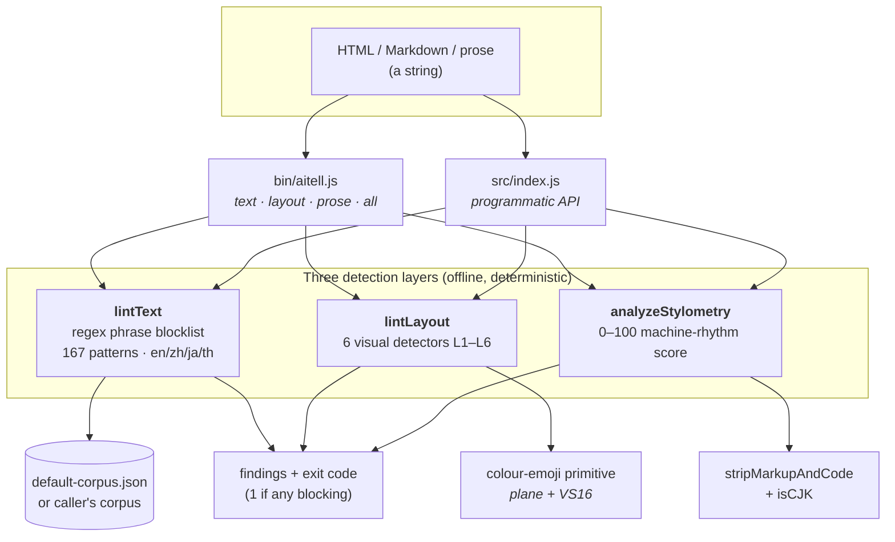
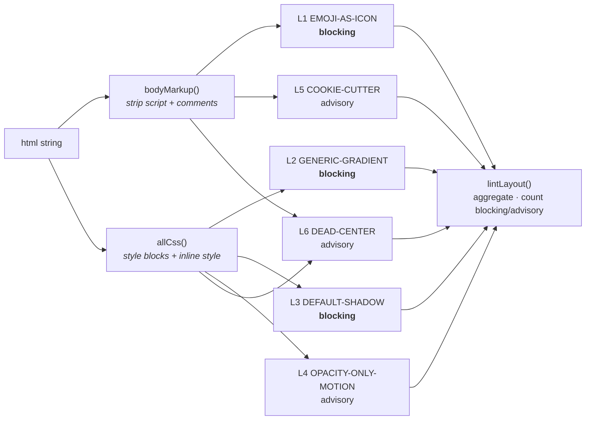

# aitell architecture

`aitell` is three independent detection layers behind one entry point and one
CLI. Every box below is a pure function of a string. Nothing reads the network,
nothing calls a model, and nothing depends on anything outside the package.

## The shape



## The layout layer, expanded

The six visual detectors each take the extracted body markup, the extracted CSS,
or both. They run independently and their findings are concatenated.



## File map

```
packages/aitell/
├── src/
│   ├── index.js           entry point — re-exports the three layers + primitives
│   ├── text-detect.js     lintText, colour-emoji detector, prose helpers
│   ├── layout-detect.js   the six visual detectors + lintLayout
│   ├── stylometry.js      analyzeStylometry + the weighted signals
│   └── default-corpus.json  167 patterns across en / zh / ja / th
├── bin/
│   └── aitell.js          CLI: text | layout | prose | all, --json, exit codes
├── test/
│   ├── text-detect.test.js     14 tests
│   ├── layout-detect.test.js   18 tests
│   └── stylometry.test.js       8 tests
└── README.md
```

## Design rules

1. **A layer is a pure function of a string.** No file reads inside the
   detectors; the CLI is the only thing that touches the filesystem. This is why
   the same functions run in a browser, a worker, or a test with no shims.
2. **Blocking vs advisory is explicit per finding.** L1–L3 are near-certain
   tells and block. L4–L6 are smells that are sometimes correct, so they inform.
   The CLI's exit code keys off blocking findings only.
3. **Every finding is explainable.** Rule id, location, matched text, and a fix.
   No layer ever returns an opaque score with no reasons attached.
4. **The corpus is data, not code.** `lintText` takes any
   `{ rules: [...] }` object, so a project can ship its own house-style tells
   without forking the engine.

## Dependencies

None at runtime. `vitest` is the only devDependency. The package is plain
CommonJS and targets Node ≥ 18.
